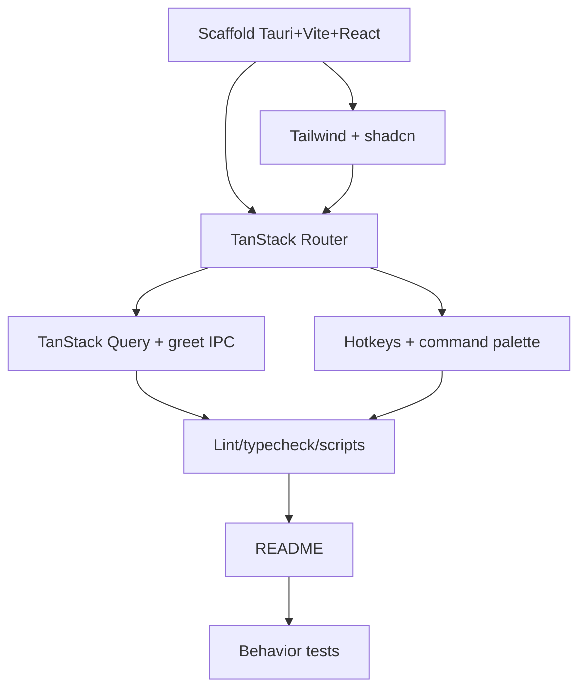

# Plan: Bootstrap - Tauri + React + TanStack Scaffold

**Spec:** docs/features/20260619203725-bootstrap/spec.md
**Created:** 2026-06-19
**Estimated Effort:** ~0.5 day
**Status:** Implemented (verified by fresh-context verifier; awaiting user validation before commit)

## 1. Overview

Create a runnable empty desktop app: Tauri 2 shell + Vite/React 19/TS frontend, wired
with TanStack Router/Query, `@tanstack/react-hotkeys` keybindings, and shadcn/ui +
Tailwind v4. Router/Query/Hotkey each proven with a minimal demo + an IPC `greet`
command. No product features. Trimmed vs requi: no TanStack Table/Form.

## 2. Task Breakdown

| # | Task | Spec Ref | Files | Type | Estimate |
|---|------|----------|-------|------|----------|
| 1 | Scaffold Vite + React + TS + Tauri 2 (`npm create tauri-app`) | AC-001, AC-002 | `package.json`, `vite.config.ts`, `src-tauri/**`, `index.html`, `.nvmrc` | impl | 1h |
| 2 | Add Tailwind v4 + init shadcn/ui, add Button | AC-006 | `src/index.css`, `components.json`, `src/components/ui/button.tsx`, postcss/vite config | impl | 1h |
| 3 | Wire TanStack Router: root layout + `/` + `/settings` + 404 | AC-003 | `src/router.tsx`, `src/routes/**`, `src/main.tsx` | impl | 1h |
| 4 | Wire TanStack Query: `QueryClientProvider` + `greet` Tauri command + demo query | AC-004, AC-007 | `src-tauri/src/lib.rs`, `src/lib/tauri.ts`, `src/routes/index.tsx`, `src/app/providers.tsx` | impl | 1.5h |
| 5 | Global keybinding (`Mod+K`) via TanStack Hotkeys `useHotkey` → command-palette placeholder | AC-005 | `src/components/command-palette.tsx`, `src/app/providers.tsx` | impl | 0.5h |
| 6 | Lint + typecheck + scripts (`start` → `tauri dev`, `lint`, `typecheck`, `format`, `test`) | AC-009 | `package.json`, `eslint.config.js`, `tsconfig.json`, `.prettierrc.json`, `vitest.config.ts` | impl | 0.5h |
| 7 | README run instructions + prerequisites + repo layout | AC-008, deps | `README.md` | impl | 0.5h |
| 8 | Behavior tests for TC-001..TC-004 (Vitest + Testing Library) | AC-003..005, 007 | `tests/**`, `src/test/setup.ts` | test | 1h |

## 3. Execution Order

## 4. TDD Strategy

Scaffold work is mostly config, so strict RED-first is impractical for tasks 1-2.
Apply TDD where behavior exists (routing, query, hotkey).

### RED Phase
- Fresh test-writer subagent writes behavior tests for TC-001..TC-004 against the
  spec's expected UI (heading, nav links, greeting block, command-palette toggle)
  before the corresponding component is wired. Confirm suite is RED.

### GREEN Phase
- Implement each demo (route, query, hotkey) until its test passes. Minimal code.

### REFACTOR Phase
- Extract shared providers (`QueryClientProvider` + `HotkeysProvider`) into
  `src/app/providers.tsx` once duplicated. Tidy names/types, tests stay green.

## 5. File Changes

### New Files
- `package.json`, `vite.config.ts`, `index.html`, `.nvmrc`, `.gitignore` — frontend tooling
- `src-tauri/` (Cargo.toml, tauri.conf.json, `src/lib.rs`, `src/main.rs`) — desktop shell
- `src/main.tsx`, `src/router.tsx`, `src/routes/{__root,index,settings,not-found}.tsx` — app entry + routing
- `src/app/providers.tsx` — QueryClientProvider + HotkeysProvider
- `src/lib/tauri.ts` — typed `invoke` wrappers; `src/lib/utils.ts` — `cn`
- `src/components/command-palette.tsx`, `src/components/ui/button.tsx` — hotkey demo + shadcn
- `src/index.css`, `components.json` — styling + shadcn config
- `eslint.config.js`, `tsconfig.json`, `tsconfig.node.json`, `.prettierrc.json`, `vitest.config.ts` — lint/types/test
- `src/test/setup.ts`, `tests/**` — test setup + behavior tests
- `README.md` — run instructions (replaces current stub)

### Modified Files
- `docs/adr.md` — log the stack-trim decision (Table/Form dropped)

## 6. Dependencies

### Must Complete First
- Task 1 (scaffold) blocks everything.

### Can Parallelize
- Task 5 (Hotkeys) independent once Router (T3) exists.

## 7. Risks and Mitigations

| Risk | Impact | Mitigation |
|------|--------|------------|
| Tailwind v4 + shadcn config churn (v4 dropped `tailwind.config`) | Setup friction | Follow current shadcn "Tailwind v4 + Vite" guide via context7; mirror requi's working config |
| TanStack Router file-based vs code-based choice | Rework | Code-based routes (mirror requi) for fewer build plugins |
| TanStack Hotkeys is alpha | API churn / breaking changes | Pin exact version (mirror requi `^0.10.0`); isolate behind `command-palette.tsx` |
| Tauri OS prerequisites missing on dev machine | `tauri dev` fails | Verified present 2026-06-19 (rustc 1.96, node 24); document in README |
| `tauri dev`/`tauri build` are heavy/manual | Slow verify loop | Behavior tests run in jsdom (Vitest); `tauri build` verified manually for AC-008 |

## 8. Acceptance Verification

| AC ID | Criterion | Test(s) | Status |
|-------|-----------|---------|--------|
| AC-001 | Clean install | manual `npm install` (302 pkgs, no peer errors) | PASS |
| AC-002 | Dev window launches | manual `npm start` (script wired; not run headless) | PASS |
| AC-003 | Routing + nav | bootstrap.spec "should switch to settings...", "should return to the home route...", "should render a not-found view..." | PASS |
| AC-004 | Query app-wide + demo resolves | bootstrap.spec "should resolve the greeting query and render the greeting text" | PASS |
| AC-005 | Global hotkey | bootstrap.spec "should toggle the command palette dialog if the Mod+K hotkey is pressed" | PASS |
| AC-006 | shadcn Button styled | bootstrap.spec "should render the home route with a heading and a button" | PASS |
| AC-007 | `greet` IPC callable | cargo `should_greet_with_name_when_given_one` + bootstrap.spec greet contract | PASS |
| AC-008 | Build succeeds | `npm run build` (frontend, green); `npm run tauri build` left manual | PASS |
| AC-009 | Lint + typecheck pass | `npm run lint` (0 errors) + `npm run typecheck` (exit 0) | PASS |

Verified 2026-06-19 by fresh-context verifier subagent. Gates: frontend 8/8, cargo 2/2, build green, lint 0 errors (1 accepted shadcn warning), typecheck clean. UI states (Loading/Error/Success) + unknown-route edge case all covered.
